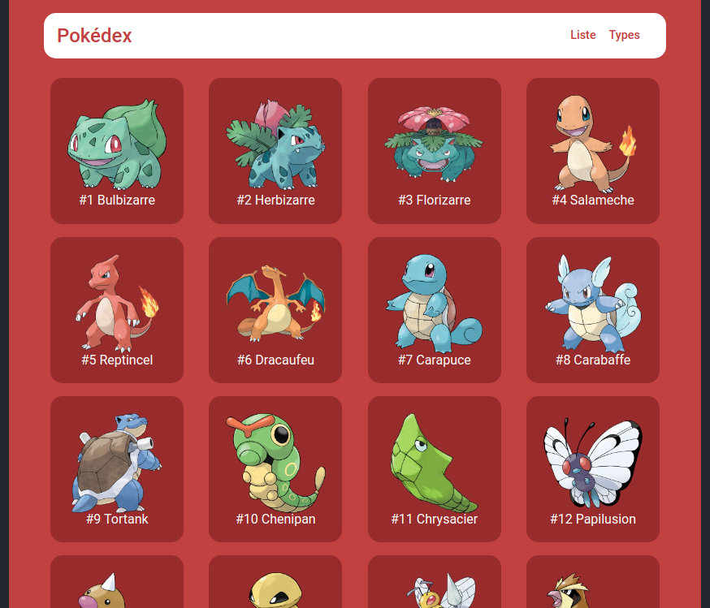
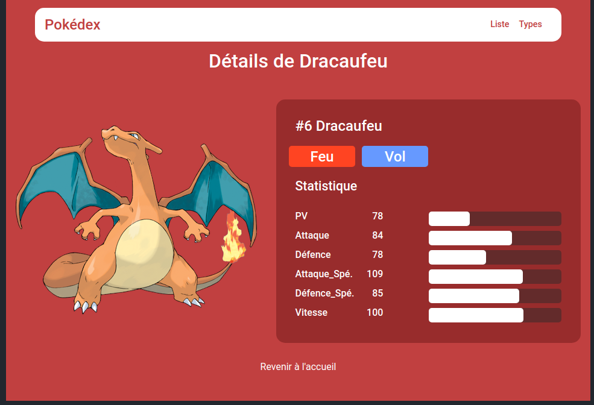
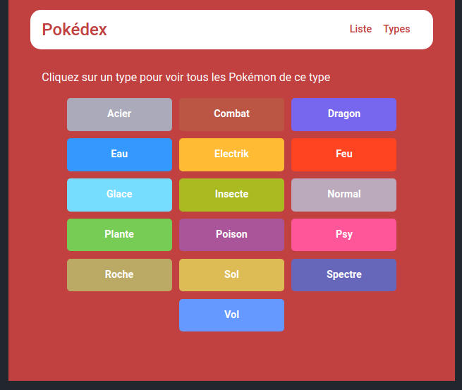
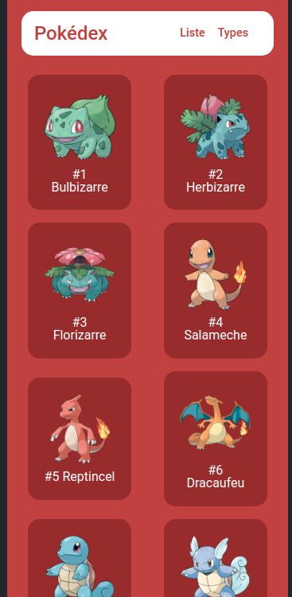
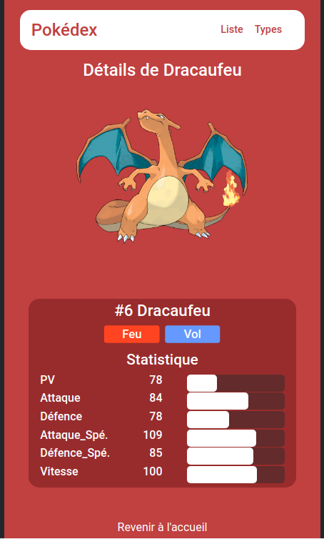

# Pokédex by @Punky

Apprentis professeurs Chen, voici un pokédex tout beau, tout neuf !

Outils utilisés pour cette mission :
- NodeJS
- HTML et CSS
- express et ses copains (ejs, dotenv et node-dev)

La base de donnée est contenu sur un fichier .json

### Index Pokédex

### Détail Pokémon

### Type Pokémon

### Index Pokédex version mobile

### Détail Pokémon version mobile

